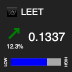
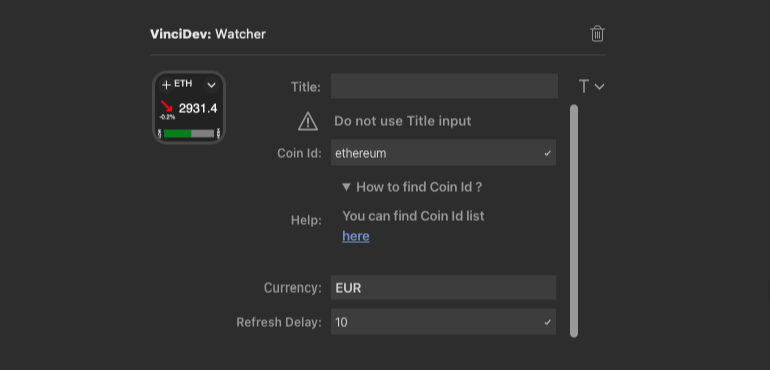

# 📈 Watcher plugin

## Description :

This plugin display the current value and the 24h change for a specific coin. Data can be updated by pressing the configured key in your Stream Deck and using the integrated scheduler.

## Settings :

* Title : Do not use this input
* Coin Id : The Id of the coin you want to watch. A link is available with all supported coins
* Currency : currency used to display coin value. Only USD, EUR, and GBP are available for now
* Refresh Delay : duration between 2 refresh of the data

## Download :

> Coming soon