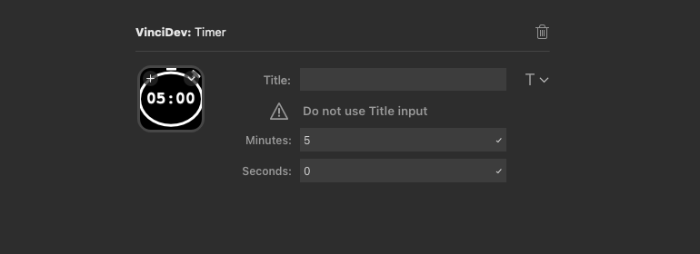

# ⏲️ Timer plugin

## Description :

This plugin give you a timer usable in your Stream Deck controller. Start & stop the timer by pressing the configured key in your Stream Deck.

## Settings :

* Title : Do not use this input
* Minutes : minutes of your timer
* Seconds : seconds of your timer

## Download :

> Coming soon